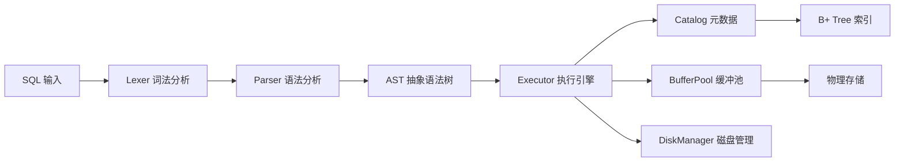

# qinDB - 现代化轻量级关系型数据库

[](CHANGELOG.md)

## 项目简介

**qinDB** 是一个现代化、轻量级的关系型数据库系统，专为学习和开发测试场景设计。它采用 C++20 和 Qt6 构建，提供了完整的 SQL 解析、执行引擎和数据库管理功能。

### 核心特性

- 🔍 **完整的 SQL 解析器** - 支持词法分析、语法分析和 AST 生成
- 📊 **60+ 种数据类型索引** - 支持整数、浮点数、字符串、日期时间等多种数据类型
- 🚀 **高性能 B+ 树索引** - 基于泛型实现的 B+ 树，支持快速数据检索
- 🔐 **用户认证系统** - 完整的用户管理和权限控制
- 🌐 **网络服务器** - 支持 TCP/IP 连接的网络数据库服务
- 📝 **详细日志记录** - 完整的系统日志和分析日志功能
- 🎯 **交互式 CLI** - 友好的命令行界面，支持多行 SQL 输入
- 💾 **持久化存储** - 基于 WAL 的数据持久化机制

## 快速开始

### 系统要求

- **操作系统**: Windows 10+, macOS 10.15+, Linux (glibc 2.31+)
- **编译器**: MSVC 2019+, GCC 11+, Clang 13+
- **内存**: 4GB RAM (推荐 8GB)
- **磁盘**: 1GB 可用空间

### 编译安装

#### 使用 CMake 编译

```bash
# 克隆项目
git clone https://github.com/programming666/qindb.git
cd qindb

# 创建构建目录
mkdir build && cd build

# 配置项目（需要 Qt6 开发环境）
cmake .. 

# 编译项目
cmake --build . --config Release --parallel 4
```

#### Windows 平台

```cmd
# 使用 Visual Studio 开发者命令提示符
mkdir build
cd build
cmake ..
cmake build --build --config release
```

### 运行 qinDB

编译完成后，直接运行可执行文件：

```bash
./qindb
```

这将启动交互式数据库客户端：

```
╔═══════════════════════════════════════════════════════════╗
║                      qinDB v1.0.0                         ║
║                      关系型数据库                         ║
╚═══════════════════════════════════════════════════════════╝

欢迎来到qinDB!
输入'help'获取帮助信息,输入'exit'或'quit'退出.
default>
```

## 功能特性

### 1. 数据库管理

```sql
-- 创建数据库
CREATE DATABASE mydb;

-- 删除数据库
DROP DATABASE mydb;

-- 切换数据库
USE DATABASE mydb;

-- 列出所有数据库
SHOW DATABASES;
```

### 2. 表操作

```sql
-- 创建表
CREATE TABLE users (
    id INT PRIMARY KEY,
    name VARCHAR(100) NOT NULL,
    email VARCHAR(255) UNIQUE,
    age INT,
    created_at TIMESTAMP DEFAULT CURRENT_TIMESTAMP
);

-- 查看表结构
DESCRIBE users;

-- 删除表
DROP TABLE users;

-- 列出所有表
SHOW TABLES;
```

### 3. 索引管理

```sql
-- 创建索引（支持60+种数据类型）
CREATE INDEX idx_users_email ON users(email);
CREATE INDEX idx_users_age ON users(age);

-- 删除索引
DROP INDEX idx_users_email;
```

### 4. 数据操作

```sql
-- 插入数据
INSERT INTO users (name, email, age) VALUES
    ('张三', 'zhangsan@example.com', 25),
    ('李四', 'lisi@example.com', 30);

-- 查询数据
SELECT * FROM users WHERE age > 27;
SELECT name, email FROM users ORDER BY name ASC;

-- 更新数据
UPDATE users SET age = 31 WHERE name = '李四';

-- 删除数据
DELETE FROM users WHERE age < 20;
```

### 5. 高级查询

```sql
-- 表连接
SELECT u.name, p.title
FROM users u
INNER JOIN posts p ON u.id = p.user_id;

-- 分组和聚合
SELECT age, COUNT(*) as count
FROM users
GROUP BY age
HAVING COUNT(*) > 1;

-- 限制结果
SELECT * FROM users ORDER BY created_at DESC LIMIT 10;
```

## 配置说明

qinDB 使用 `qindb.ini` 文件进行配置：

```ini
[Output]
VerboseOutput=false          # 是否显示详细分析信息
AnalysisLogEnabled=false     # 是否启用分析日志
AnalysisLogPath=qindb_analysis.log  # 分析日志路径
ShowResults=true            # 是否显示查询结果
ShowSummary=true            # 是否显示简要信息

[SystemLog]
LogPath=qindb.log           # 系统日志路径
ConsoleOutput=true          # 是否输出日志到控制台

[Database]
BufferPoolSize=1024         # 缓冲池大小（页数）
DefaultDbPath=qindb.db      # 默认数据库路径

[Network]
Enabled=true                # 是否启用网络服务器
Address=0.0.0.0             # 服务器监听地址
Port=24678                  # 服务器端口
MaxConnections=1000         # 最大连接数
```

## 技术架构

### 核心组件

- **Lexer** (`lexer.h/cpp`) - 词法分析器，将 SQL 字符串分解为 Token
- **Parser** (`parser.h/cpp`) - 语法分析器，生成抽象语法树 (AST)
- **Executor** (`executor.h/cpp`) - 查询执行引擎，执行 AST 操作
- **Catalog** (`catalog.h/cpp`) - 元数据管理，存储表结构信息
- **BufferPool** (`buffer_pool_manager.h/cpp`) - 缓冲池管理，提高 I/O 性能
- **DiskManager** (`disk_manager.h/cpp`) - 磁盘管理，负责数据持久化
- **B+ Tree** (`bplus_tree.h/cpp`) - 索引结构，支持高效数据检索
- **AuthManager** (`auth_manager.h/cpp`) - 用户认证和权限管理

### 数据流程



### 索引支持的数据类型

qinDB 支持以下 60+ 种数据类型的索引：

- **整数类型**: `INT`, `BIGINT`, `SMALLINT`, `TINYINT`, `SERIAL`
- **浮点类型**: `FLOAT`, `DOUBLE`, `REAL`, `DECIMAL`
- **字符串类型**: `VARCHAR`, `CHAR`, `TEXT`, `NVARCHAR`
- **日期时间**: `DATE`, `TIMESTAMP`, `DATETIME`
- **其他类型**: `BOOLEAN`, `JSON`, `UUID` 等

## 开发指南

### 项目结构

```
qindb/
├── include/           # 头文件目录
│   └── qindb/         # 核心头文件
├── src/              # 源代码目录
│   ├── auth/         # 认证相关
│   ├── catalog/      # 元数据管理
│   ├── executor/     # 执行引擎
│   ├── index/        # 索引实现
│   ├── storage/      # 存储引擎
│   └── utils/        # 工具类
├── tests/            # 测试代码
├── docs/             # 文档
├── build/            # 构建目录
├── main.cpp          # 主程序入口
└── qindb.ini         # 配置文件
```


### 测试

运行单元测试：

```bash
./build/qindb_tests.exe
```

## 贡献指南

我们欢迎社区贡献！请遵循以下步骤：

1. **Fork 项目** 到你的 GitHub 账户
2. **创建功能分支**：`git checkout -b feature/your-feature`
3. **提交更改**：`git commit -m 'Add some feature'`
4. **推送到分支**：`git push origin feature/your-feature`
5. **创建 Pull Request**

### 代码规范

- 使用 C++20 标准
- 遵循 Google C++ 代码规范
- 添加适当的注释和文档
- 确保通过所有测试

## 许可证

本项目采用 MIT 许可证，详见 [LICENSE](LICENSE) 文件。

## 联系方式
邮箱：mailto:contact@qinyining.cn

- **项目主页**: https://github.com/programming666/QinDB
- **问题反馈**: https://github.com/programming666/QinDB/issues

## 致谢

感谢所有为 qinDB 做出贡献的开发者和测试者！

---

**qinDB** - 让数据库开发变得更简单 🚀