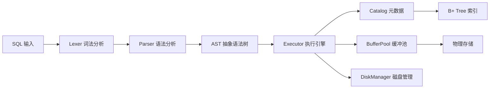

# qinDB - 现代化轻量级关系型数据库

[](CHANGELOG.md)
[](LICENSE)

## 项目简介

**qinDB** 是一个现代化、轻量级的关系型数据库系统，专为学习和开发测试场景设计。它采用 C++20 和 Qt6 构建，提供了完整的 SQL 解析、执行引擎和数据库管理功能。

### 核心特性

- 🔍 **完整的 SQL 解析器** - 支持词法分析、语法分析和 AST 生成
- 📊 **60+ 种数据类型索引** - 支持整数、浮点数、字符串、日期时间、JSON、UUID等多种数据类型
- 🚀 **高性能 B+ 树索引** - 基于泛型实现的 B+ 树，支持快速数据检索
- 📚 **多种索引类型** - 支持哈希索引、复合索引、倒排索引（全文搜索）
- 🔐 **用户认证系统** - 完整的用户管理和权限控制
- 🌐 **网络服务器** - 支持 TCP/IP 连接的网络数据库服务，内置TLS加密
- 📝 **详细日志记录** - 完整的系统日志和分析日志功能
- 🎯 **交互式 CLI** - 友好的命令行界面，支持多行 SQL 输入
- 💾 **持久化存储** - 基于 WAL 的数据持久化机制
- ⚡ **查询优化器** - 基于成本模型的智能查询优化
- 🔄 **事务支持** - 完整的ACID事务机制
- 💨 **查询缓存** - 智能查询结果缓存，提升重复查询性能
- 📈 **统计信息** - 自动收集表和索引统计信息，辅助查询优化
- 🛡️ **安全特性** - Argon2id密码哈希、TLS加密传输、SQL注入防护

### 新增功能 (v2.0)

- ⚡ **智能查询优化器** - 基于成本模型的查询计划优化，支持单表和多表连接优化
- 🔄 **完整事务支持** - 支持BEGIN、COMMIT、ROLLBACK，保证ACID特性
- 💨 **多级缓存系统** - 查询缓存和表缓存，显著提升重复查询性能
- 📚 **丰富索引类型** - 除了B+树索引，新增哈希索引、复合索引、全文索引
- 📊 **自动统计信息** - 自动收集和更新表/索引统计信息，辅助优化决策
- 💾 **高级存储特性** - WAL日志、清理机制、空间回收
- 📤 **数据导出功能** - 支持CSV、JSON等多种格式的数据导出

## 快速开始

### 系统要求

- **操作系统**: Windows 10+, macOS 10.15+, Linux (glibc 2.31+)
- **编译器**: MSVC 2019+, GCC 11+, Clang 13+
- **内存**: 4GB RAM (推荐 8GB)
- **磁盘**: 1GB 可用空间

### 编译安装

#### 使用 CMake 编译

```bash
# 克隆项目
git clone https://github.com/programming666/qindb.git
cd qindb

# 创建构建目录
mkdir build && cd build

# 配置项目（需要 Qt6 开发环境）
cmake .. 

# 编译项目
cmake --build . --config Release --parallel 4
```

#### Windows 平台

```cmd
# 使用 Visual Studio 开发者命令提示符
mkdir build
cd build
cmake ..
cmake build --build --config release
```

### 运行 qinDB

编译完成后，直接运行可执行文件：

```bash
./qindb
```

这将启动交互式数据库客户端：

```
╔═══════════════════════════════════════════════════════════╗
║                      qinDB v2.0.0                         ║
║                 现代化关系型数据库                        ║
╚═══════════════════════════════════════════════════════════╝

欢迎来到qinDB!
输入'help'获取帮助信息,输入'exit'或'quit'退出.
default>
```

## 功能特性

### 1. 数据库管理

```sql
-- 创建数据库
CREATE DATABASE mydb;

-- 删除数据库
DROP DATABASE mydb;

-- 切换数据库
USE DATABASE mydb;

-- 列出所有数据库
SHOW DATABASES;
```

### 2. 表操作

```sql
-- 创建表
CREATE TABLE users (
    id INT PRIMARY KEY,
    name VARCHAR(100) NOT NULL,
    email VARCHAR(255) UNIQUE,
    age INT,
    created_at TIMESTAMP DEFAULT CURRENT_TIMESTAMP
);

-- 查看表结构
DESCRIBE users;

-- 删除表
DROP TABLE users;

-- 列出所有表
SHOW TABLES;
```

### 3. 索引管理

```sql
-- 创建B+树索引（支持60+种数据类型）
CREATE INDEX idx_users_email ON users(email);
CREATE INDEX idx_users_age ON users(age);

-- 创建哈希索引
CREATE HASH INDEX idx_users_username ON users(username);

-- 创建复合索引
CREATE INDEX idx_users_name_age ON users(name, age);

-- 创建全文索引（倒排索引）
CREATE FULLTEXT INDEX idx_posts_content ON posts(content);

-- 删除索引
DROP INDEX idx_users_email;
```

### 4. 数据操作

```sql
-- 插入数据
INSERT INTO users (name, email, age) VALUES
    ('张三', 'zhangsan@example.com', 25),
    ('李四', 'lisi@example.com', 30);

-- 查询数据
SELECT * FROM users WHERE age > 27;
SELECT name, email FROM users ORDER BY name ASC;

-- 更新数据
UPDATE users SET age = 31 WHERE name = '李四';

-- 删除数据
DELETE FROM users WHERE age < 20;
```

### 5. 高级查询

```sql
-- 表连接
SELECT u.name, p.title
FROM users u
INNER JOIN posts p ON u.id = p.user_id;

-- 分组和聚合
SELECT age, COUNT(*) as count
FROM users
GROUP BY age
HAVING COUNT(*) > 1;

-- 限制结果
SELECT * FROM users ORDER BY created_at DESC LIMIT 10;

-- 全文搜索
SELECT * FROM posts 
WHERE MATCH(content) AGAINST('数据库优化');

-- 子查询优化
SELECT name FROM users 
WHERE id IN (SELECT user_id FROM orders WHERE amount > 1000);
```

### 6. 事务管理

```sql
-- 开始事务
BEGIN TRANSACTION;

-- 执行多个操作
UPDATE accounts SET balance = balance - 100 WHERE id = 1;
UPDATE accounts SET balance = balance + 100 WHERE id = 2;
INSERT INTO transactions (from_id, to_id, amount) VALUES (1, 2, 100);

-- 提交事务
COMMIT;

-- 回滚事务
ROLLBACK;
```

### 7. 用户管理

qinDB 提供了完整的用户管理系统，支持用户创建、密码修改、权限控制等功能。

#### 默认管理员账户

系统初始化时会自动创建默认管理员：
- **用户名**: `admin`
- **密码**: `admin` (首次使用后建议修改)

#### 创建用户

```sql
-- 创建普通用户
CREATE USER qin IDENTIFIED BY '123456';

-- 创建管理员用户
CREATE USER superuser IDENTIFIED BY 'strong_password' WITH ADMIN;
```

#### 修改密码

```sql
-- 修改用户密码
ALTER USER admin IDENTIFIED BY 'new_secure_password';
```

#### 删除用户

```sql
-- 删除用户
DROP USER qin;
```

**注意**: 不能删除最后一个管理员用户（系统保护机制）

### 8. 数据导出

```sql
-- 导出查询结果到CSV文件
EXPORT TO 'users.csv' DELIMITER ',' 
SELECT * FROM users;

-- 导出特定格式的数据
EXPORT TO 'report.json' FORMAT JSON
SELECT u.name, COUNT(p.id) as post_count 
FROM users u LEFT JOIN posts p ON u.id = p.user_id 
GROUP BY u.name;
```

#### 查询用户信息

```sql
-- 切换到系统数据库
USE qindb;

-- 查看所有用户
SELECT * FROM users;

-- 查看管理员
SELECT username, created_at FROM users WHERE is_admin = 1;

-- 查看激活的用户
SELECT username FROM users WHERE is_active = 1;
```

#### 权限管理

```sql
-- 授予用户对数据库的所有权限
GRANT ALL ON database_name TO username;

-- 授予查询权限
GRANT SELECT ON database_name.table_name TO username;

-- 撤销权限
REVOKE ALL ON database_name FROM username;
```

#### 密码安全

- **加密算法**: Argon2id (内存成本 65536 KB, 3 次迭代, 4 线程)
- **密码强度**: 系统会对非管理员用户的密码进行强度检查
- **最佳实践**: 建议使用至少 12 个字符，包含大小写字母、数字和特殊字符


## 配置说明

qinDB 使用 `qindb.ini` 文件进行配置：

```ini
[Output]
VerboseOutput=false          # 是否显示详细分析信息
AnalysisLogEnabled=false     # 是否启用分析日志
AnalysisLogPath=qindb_analysis.log  # 分析日志路径
ShowResults=true            # 是否显示查询结果
ShowSummary=true            # 是否显示简要信息

[SystemLog]
LogPath=qindb.log           # 系统日志路径
ConsoleOutput=true          # 是否输出日志到控制台

[Database]
BufferPoolSize=1024         # 缓冲池大小（页数）
DefaultDbPath=qindb.db      # 默认数据库路径
EnableTransaction=true      # 是否启用事务支持
WalEnabled=true            # 是否启用WAL日志

[Cache]
QueryCacheEnabled=true      # 是否启用查询缓存
QueryCacheSize=100         # 查询缓存最大条目数
QueryCacheMemory=64        # 查询缓存最大内存(MB)
QueryCacheTTL=300          # 查询缓存过期时间(秒)
TableCacheEnabled=true     # 是否启用表缓存
TableCacheSize=50          # 表缓存最大数量

[Network]
Enabled=true                # 是否启用网络服务器
Address=0.0.0.0             # 服务器监听地址
Port=24678                  # 服务器端口
MaxConnections=1000         # 最大连接数
TlsEnabled=false           # 是否启用TLS加密
AutoGenerateCerts=true     # 是否自动生成证书

[Optimizer]
EnableCostOptimizer=true    # 是否启用成本优化器
AutoUpdateStatistics=true  # 是否自动更新统计信息
StatisticsSampleRate=0.1   # 统计信息采样率
```

### TLS 加密与证书生成

- 功能概述：服务器支持 TLS 加密连接，并内置自签名证书生成，完全使用 C++ 实现，不依赖外部命令。
- 平台实现：
  - Windows 使用 CryptoAPI 生成 RSA 密钥与自签名 X.509 证书；代码参考 `src/network/certificate_generator.cpp:28`。
  - Linux 使用 OpenSSL C API 生成 RSA 密钥与自签名 X.509 证书；代码参考 `src/network/certificate_generator.cpp:210`。
- 服务器启用 TLS：

```cpp
#include "qindb/server.h"

qindb::Server server(dbManager, authManager);
// 若证书/私钥不存在且 autoGenerate=true，将自动生成并保存
server.enableTLS("server_cert.pem", "server_key.pem", /*autoGenerate=*/true);
server.start("0.0.0.0", 24678);
```

- 自动生成与加载流程：实现入口见 `src/network/server.cpp:92`；具体生成调用 `TLSConfig::generateSelfSigned`（`src/network/tls_config.cpp:76`），最终落盘通过 `TLSConfig::saveToFiles`。
- 构建依赖：
  - Windows：无需额外安装；链接系统库 `Crypt32`、`Advapi32`（CMake 已配置）。
  - Linux：需要 OpenSSL 开发库；示例安装命令：

```bash
# Debian/Ubuntu
sudo apt-get update && sudo apt-get install -y libssl-dev

# CentOS/RHEL
sudo yum install -y openssl-devel
```

- CMake 链接示例（已在项目中按平台自动配置）：

```cmake
target_link_libraries(qindb PRIVATE
    Qt::Core Qt::Network
    $<$<BOOL:${WIN32}>:Crypt32>
    $<$<BOOL:${WIN32}>:Advapi32>
    $<$<BOOL:${UNIX}>:OpenSSL::Crypto>
    $<$<BOOL:${UNIX}>:OpenSSL::SSL>
)
```

- 测试验证：
  - 运行 TLS 相关测试用例（名称已注册到 CTest）：

```bash
ctest -R test_tls_handshake -C Release --output-on-failure
ctest -R test_tls_handshake_simple -C Release --output-on-failure
ctest -R test_ssl_error_handler -C Release --output-on-failure
```


## 技术架构

### 核心组件

- **Lexer** (`lexer.h/cpp`) - 词法分析器，将 SQL 字符串分解为 Token
- **Parser** (`parser.h/cpp`) - 语法分析器，生成抽象语法树 (AST)
- **Executor** (`executor.h/cpp`) - 查询执行引擎，执行 AST 操作
- **Catalog** (`catalog.h/cpp`) - 元数据管理，存储表结构信息
- **BufferPool** (`buffer_pool_manager.h/cpp`) - 缓冲池管理，提高 I/O 性能
- **DiskManager** (`disk_manager.h/cpp`) - 磁盘管理，负责数据持久化
- **B+ Tree** (`bplus_tree.h/cpp`) - 索引结构，支持高效数据检索
- **AuthManager** (`auth_manager.h/cpp`) - 用户认证和权限管理

### 数据流程



### 索引支持的数据类型

qinDB 支持以下 60+ 种数据类型的索引：

- **整数类型**: `INT`, `BIGINT`, `SMALLINT`, `TINYINT`, `SERIAL`
- **浮点类型**: `FLOAT`, `DOUBLE`, `REAL`, `DECIMAL`
- **字符串类型**: `VARCHAR`, `CHAR`, `TEXT`, `NVARCHAR`
- **日期时间**: `DATE`, `TIMESTAMP`, `DATETIME`
- **其他类型**: `BOOLEAN`, `JSON`, `UUID` 等


### 特别提示：

请不要强制停止数据库进程，这会导致数据库损坏！


## 开发指南

### 项目结构

```
qindb/
├── include/           # 头文件目录
│   └── qindb/         # 核心头文件
├── src/              # 源代码目录
│   ├── auth/         # 认证相关
│   ├── catalog/      # 元数据管理
│   ├── executor/     # 执行引擎
│   ├── index/        # 索引实现
│   ├── storage/      # 存储引擎
│   └── utils/        # 工具类
├── tests/            # 测试代码
├── docs/             # 文档
├── build/            # 构建目录
├── main.cpp          # 主程序入口
└── qindb.ini         # 配置文件
```


### 测试

运行单元测试：

```bash
./build/qindb_tests.exe
```

## 贡献指南

我们欢迎社区贡献！请遵循以下步骤：

1. **Fork 项目** 到你的 GitHub 账户
2. **创建功能分支**：`git checkout -b feature/your-feature`
3. **提交更改**：`git commit -m 'Add some feature'`
4. **推送到分支**：`git push origin feature/your-feature`
5. **创建 Pull Request**

### 代码规范

- 使用 C++20 标准
- 遵循 Google C++ 代码规范
- 添加适当的注释和文档
- 确保通过所有测试

## 许可证

本项目采用 RPL v2.0 (互惠公共许可) 许可证，允许商业使用，详见 [LICENSE](LICENSE) 文件。

### 许可证变更说明
从 v2.0 版本开始，本项目移除了商业使用限制，允许用户自由地将qinDB用于商业目的，无需额外授权。这一变更旨在促进项目的广泛应用和社区发展。

本项目使用以下LGPL许可的组件：

组件名称：Qt Core 模块

版本：6.10

来源：https://www.qt.io/

许可证：GNU Lesser General Public License v3.0

许可证文本：见 [LICENSE.LGPL](LICENSE.LGPL) 文件

声明：本项目通过动态链接使用该模块，用户可自由替换为兼容版本

组件名称：Qt Network 模块

版本：6.10

来源：https://www.qt.io/

许可证：GNU Lesser General Public License v3.0

许可证文本：见 [LICENSE.LGPL](LICENSE.LGPL) 文件

声明：本项目通过动态链接使用该模块，用户可自由替换为兼容版本

### 替换说明
本项目通过CMake的`target_link_libraries`动态链接Qt库：
```cmake
target_link_libraries(qindb
    PRIVATE
        Qt::Core
        Qt::Network
)
```

--- 

## 联系方式
邮箱：mailto:contact@qinyining.cn

- **项目主页**: https://github.com/programming666/QinDB
- **问题反馈**: https://github.com/programming666/QinDB/issues

## 致谢

感谢所有为 qinDB 做出贡献的开发者和测试者！

---

**qinDB** - 让数据库开发变得更简单 🚀
